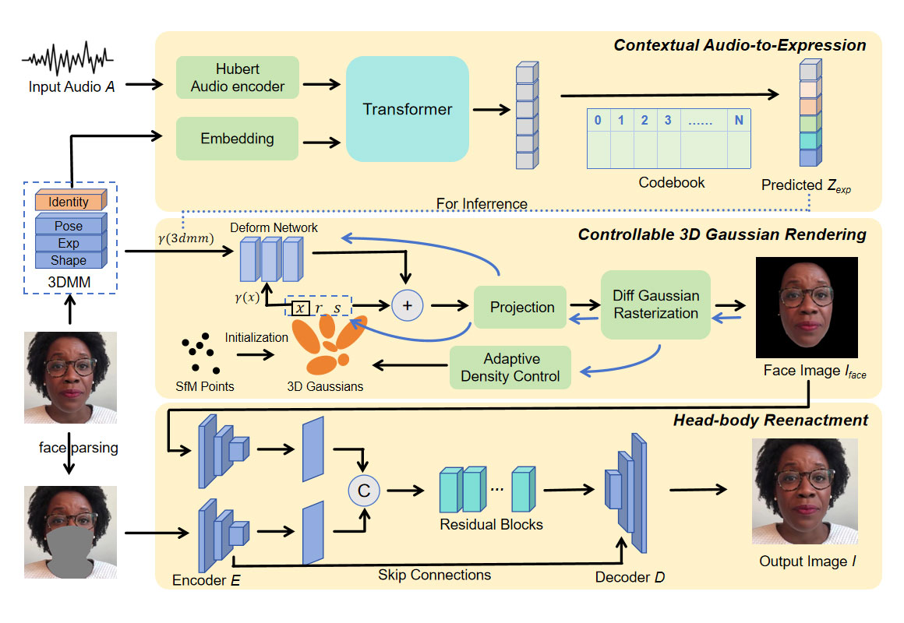

<h1 align="center">GaPTalk: Controllable 3D Gaussians for Personalized Audio-driven Talking Head Synthesis</h1>

This is the official repo of GaPTalk with Pytorch implementation, for training a personalized and expressive talking head. 

## Demo
Comparison with Wav2Lip, PC-AVS, ER-NeRF, Rad-NeRF, GaussianTalker:

https://github.com/user-attachments/assets/4ff6686a-ba41-48eb-90d8-487210f1d9e1

https://github.com/user-attachments/assets/c31dee8b-058e-43de-af8e-c3b3df534ec0

https://github.com/user-attachments/assets/4f904ee4-5484-4467-8931-d6fd02f91acd

https://github.com/user-attachments/assets/b3fa2b7f-ae25-4db5-aa27-2f0811134963

Video reconstruction from origin audio:

https://github.com/user-attachments/assets/936c9c70-f4ee-40f5-86d9-f09bc7ac1801

## Dataset
Our datasets come from HDTF

## Project

We have released the training code for Step2:controllable 3D Gaussian Rendering and Step3 Head-body-Reenactment.
Code for STEP 1:contextual audio-to-expression and dataset  will be released shortly. Our code is for research purposes only.

